# Kex

A tiny simplistic terminal file browser for use in CLI environments



## Setup for Powershell

1. Open your powershell profile with your favorite editor (`$PROFILE.CurrentUserCurrentHost`)
2. Add the code from [Invoke-Explorer.ps1]
3. Adjust the `$KexExec` parameter to point to your installation

[Invoke-Explorer.ps1]: ./KamiExplore/Invoke-Explorer.ps1

## Setup for Bash / Linux / Mac
1. Open your bash
2. Navigate to the project root
3. `./setup_kex.sh`

## Use

```sh
# enter powershell session
pwsh
# runs explorer from current directory
kex
# runs explorer from /opt dir
kex /opt
```

## Tech used

- F#
- Functional Style
- Terminal.Gui
- CommandLineParser.FSharp
- Powershell
